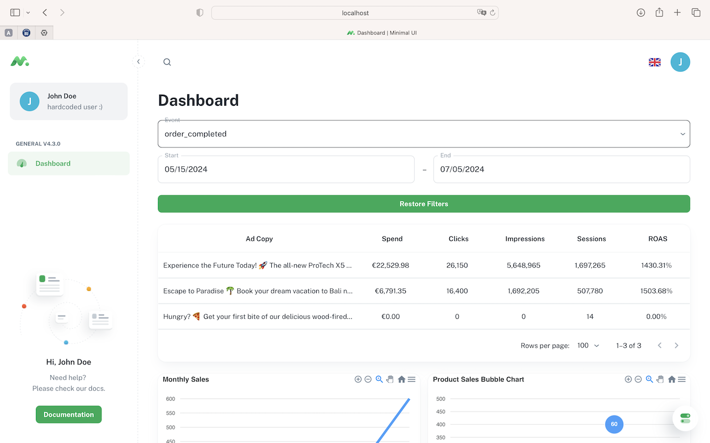

# Technical assignment for the position of Python Developer at BillyGrace



### 1. Running the project

Before running the project you need to add `.env` file in the root directory. Use `.env.example` as a template. Don't 
forget to set POSTGRES_PASSWORD and JWT_SECRET_KEY (login and password are actually hardcoded on backend but because
JWT auth was already implemented on frontend I decided to implement endpoints it uses but without hashing and storing 
passwords in database).

After that you can run the project with the following command:

```bash
make deploy
```

This command will run frontend and backend services in docker containers. It will also start the database service and 
run migrations that will create the necessary tables in the database, load the initial data and create indexes.

Frontend will be available at `http://localhost:3000/` and backend at `http://localhost:8000/docs#`.

### 2. Running tests

There are three types of tests in the project:
- unit tests for backend
- integration tests for backend (needs to have the database running)
- e2e tests on playwright (needs to have the frontend and backend running)

To run the tests you can use the following commands:

```bash
make test_backend # runs unit tests
make test_backend_integration # runs unit and integration tests
make test_e2e_ui # runs e2e tests
```

### 3. Calculating metrics

I am using this query to calculate the metrics:

```sql
WITH filtered_data AS (
    SELECT ad_id, spend, clicks, impressions, sessions, event_value
    FROM creatives.pixel_event_integrated_data
    WHERE customer_name = $1
      AND ev = $2
      AND date_column BETWEEN $3 AND $4
)
SELECT
    ad_copy,
    SUM(spend) AS spend,
    SUM(clicks) AS clicks,
    SUM(impressions) AS impressions,
    SUM(sessions) AS sessions,
    CASE
        WHEN SUM(spend) = 0 THEN 0
        ELSE SUM(event_value) / SUM(spend) * 100
    END AS roas
FROM filtered_data
JOIN creatives.dim_combined_creative USING (ad_id)
GROUP BY ad_copy;
```

However, I have some concerns about the way how ROAS is calculated. I am using this formula:

ROAS = (Revenue from Ad Campaign) / (Cost of Ad Campaign) * 100

and getting extremely high values (like 1000%). Maybe spend and event_value are not in the same currency or maybe
event_value is not attributed to the ad campaign. I would like to get your feedback on this.

### 4. Backend endpoints

I have implemented the following endpoints:

`/api/customer/{customer}/creatives/{event}/metrics` - returns the metrics for the given customer and event in format
that DataGrid component can use. I think it's better to use this format because if we want to change table layout we 
don't need to change the frontend code.

`/api/customer/{customer}/creatives/filter-options` - returns the filter options for the given customer. Frontend uses
this endpoint to populate the event dropdown and daterange filters.

I also implemented endpoints that frontend uses for login and getting the user data.

### 5. Future Improvements
While the current implementation meets the requirements of this test assignment , there are several areas where further 
enhancements could be made to improve the codebase. These enhancements have not been implemented due to time 
constraints but could be considered for future development:

- Obviously storing hashed and salted passwords in the database. I would use bcrypt and passlib for this. Or FastAPI 
Users library could be used for this purpose. I would also change login endpoint to meet OAuth2 specs. 
- Pagination for the metrics endpoint. If the number of rows is too big it could be a problem to load all of them at 
once. `fastapi-pagination` could be used for this purpose, but it also requires changing the frontend code.
- Faster CI pipeline. Docker images are built from scratch every time the pipeline is run so caching could be used to
speed up the process. Also, amount of data in the database could be reduced for tests.
- More tests. e2e tests are not checking filtering functionality. Also, there are no tests for scenarios when backend
returns errors (although frontend is handling them).
- Refactoring of the frontend code. I would split components into common and feature-specific ones.

### 6. Theoretical questions

1. **Why do you think Billy Grace has developed their own tracking pixel compared to using Google Analytics/GA4?**

   - Analytic tools provided by advertising platforms like Google Analytics or GA4 are biased towards the platform's
   interests. They are designed to track user behavior on the platform and not necessarily to provide the most accurate
   data for the advertiser. By developing their own tracking pixel, Billy Grace can have more control over the data.
   - Data from multiple sources can be combined for accurate cross-channel attribution. For example, if a user sees an ad
   on Facebook and then clicks on a Google ad, the tracking pixel can track both interactions and attribute the conversion
   to the correct source.
   - Customization and Flexibility: by developing their own tracking pixel, Billy Grace can tailor the data collection
   for their specific needs.
   - Data Ownership: by using their own tracking pixel, Billy Grace has full control over the data collected. This is
   crucial for privacy and GDPR compliance.
   - Avoiding 3rd party limitations like sampling and data retention policies. Also implementing own tracking pixel can
   be cheaper than using GA4.


2. **How would you theoretically set up a backend endpoint and processing to storage, for a tracking pixel if you have to 
build it yourself? For this you can assume you have access to an account on AWS, Azure or GCP with all services 
available**

   1. Tracking Pixel Setup:
      - The tracking pixel would be a 1x1 transparent image embedded in the HTML of the website. When a user visits the website, the browser makes a request to the tracking pixel URL.

   2. Backend Endpoint:
      - The backend GET endpoint would receive the request and extract the necessary information from the request headers (like user agent, IP address, referrer, etc.) and query parameters.
      - The backend can be set up using API Gateway and Cloud Functions (AWS Lambda or Google Cloud Functions), which are easily scalable for high load traffic and provide seamless integration with other cloud services.

   3. Data Storage:
      - This information would be stored in Amazon Redshift or Google BigQuery for further analysis. Inserting data into the database with such high frequency could be a problem, so I would use a message queue like Amazon SQS or Google Pub/Sub to buffer the data and then process it in batches.
      - Another option is to store events in Amazon S3 or Google Cloud Storage and then use AWS Glue or Google Dataflow to process the data and load it into the data warehouse.

   4. ETL and Data Analysis:
      - AWS Glue or Google Dataflow could be used for ETL processing (transforming and loading the data into the data warehouse).
      - Amazon Athena could be used for ad-hoc analysis on data stored in S3.

   5. Data Visualization:
      - AWS Quicksight or Google Data Studio could be used for data visualization and reporting.

   6. Security:
      - To ensure data integrity, I would use encryption for query parameters or use JWT tokens to sign the data so that it can't be tampered with. 
      - Rate limiting could be used to prevent abuse of the tracking pixel.


